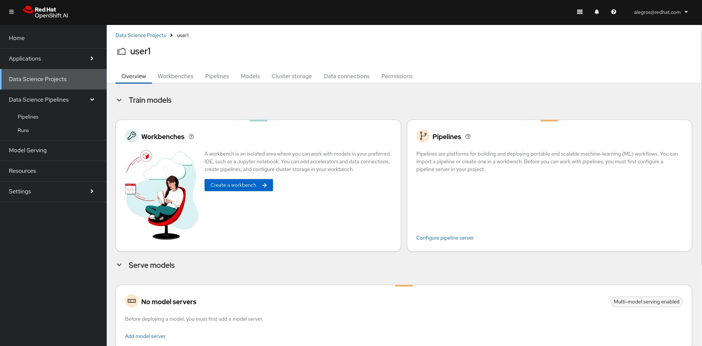
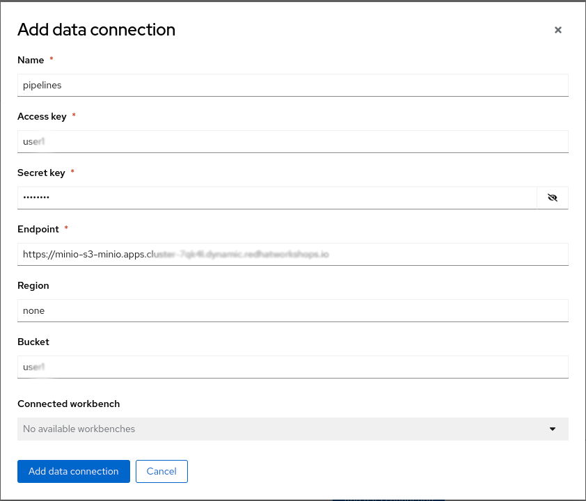
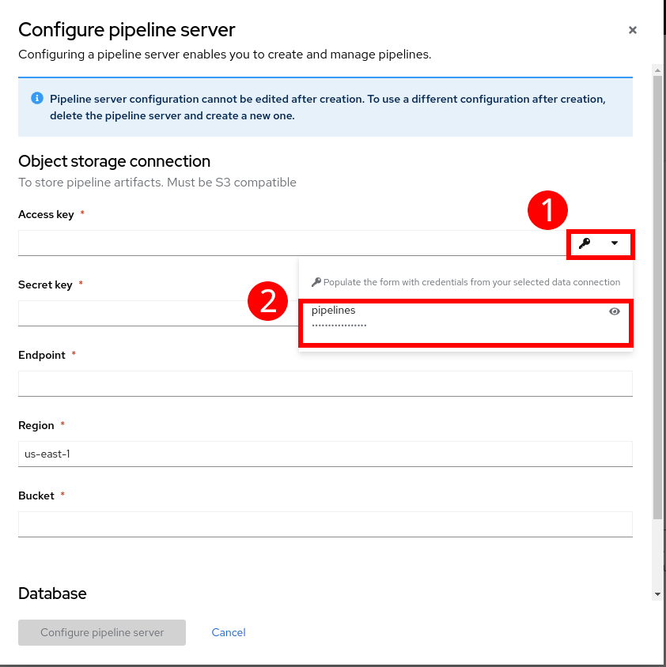
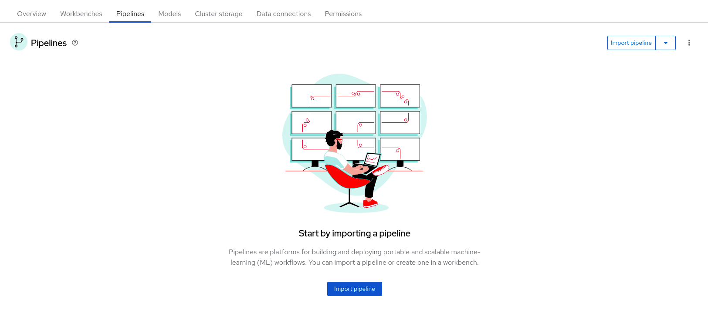

+++
title = "Préparation de l'environement"
draft= false
weight= 2
[[ressources]]
  src = '**.png'
+++

Chacun d'entre vous va

1. Se connecter à un projet Data Science
    - cela vous aidera à garder les choses en ordre

2. Créer une "Data Connection"
    - nous en avons besoin pour que le serveur de pipeline stocke ses artefacts

3. Déployer un serveur de pipeline
    - nous en aurons besoin, et il est préférable de le créer dès le départ

4. Lancer un Workbench
    - nous l'utiliserons pour exécuter nos notebooks et construire la pipeline de data science

5. Clonez le repo git dans votre Workbench
    - il contient tout le code pour l'entrainement du modèle d'IA

Les instructions ci-dessous vous guideront tout au long de ces étapes. Suivez-les attentivement.

## Connection à un projet

* Tout d'abord, dans l'application OpenShift AI Dashboard, naviguez vers le menu Data Science Projects sur la gauche :


* Un projet portant le **même nom que votre identifiant** a été créé pour vous. Un identifiant unique vous a été attribué au début du laboratoire. Souvenez-vous de cet identifiant pour la création des instances. 

Cliquez sur le projet disponible. Vous devriez arriver sur une page similaire :


## Créer une "Data Connection" pour le serveur de pipeline

* Nous avons déployé une instance pour gérer le sockage object (Minio) dans le cluster.
* Vous devrez **ajouter une Data Connection** qui pointe vers elle. Faites défiler jusqu'au bas de la page du Data Science Project et cliquez sur "Data Connections" :


* Vous arriverez sur une page pour l'instant vide. Cliquez sur "Add data connection". Voici les informations que vous devez saisir :
- Name:  
```pipelines```
- Access Key - **REPLACE WITH YOUR USER ID**:  
```userX```
- Secret Key:  
``````
- Endpoint:  
``````
- Region:  
```none```
- Bucket - **REPLACE WITH YOUR USER ID**:  
```userX```

**IMPORTANT**: Une fois de plus, la Bucket que vous utiliserez doit correspondre à l'ID utilisateur qui vous a été fourni.

* Le résultat devrait ressembler à ceci :


## Créer un serveur de pipeline

Il est fortement recommandé de créer votre serveur de pipeline avant de créer le Workbench. C'est ce que nous allons faire maintenant !

* Dans le menu en haut, cliquez sur **Pipelines**. Cliquez ensuite sur **Configure pipeline server**


* Sélectionnez la "Data Connection" créée précédemment (nommée **pipelines**) et cliquez sur le bouton **Configure pipeline server**:


* Attendez que le serveur de pipeline termine sa création. Lorsque votre serveur de pipeline est prêt, votre écran ressemblera à ce qui suit :


A ce stade, votre serveur de pipeline est prêt et déployé.

IMPORTANT : Vous devez **attendre** que le serveur de pipeline soit prêt. S'il tourne encore, attendez qu'il se termine.
