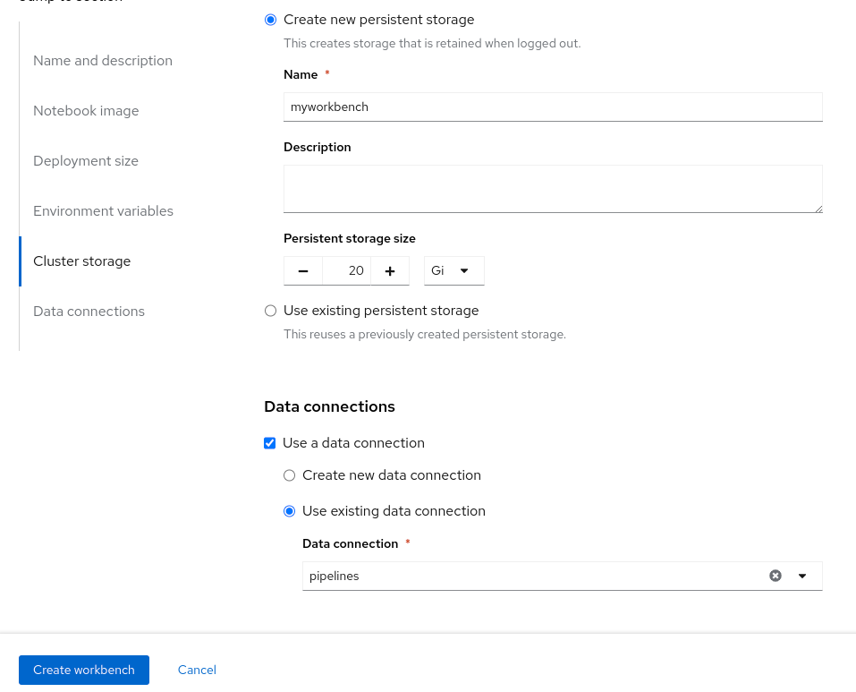
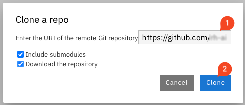

+++
title = "Creating a workbench"
draft= false
weight= 3
[[resources]]
  src = '**.png'
+++

## Launch a Workbench

* Once the Data Connection and Pipeline Server are fully created
* Create a workbench

* Make sure it has the following characteristics:  
    * Choose a name for it, like: `My Workbench`  
    * Image Selection: `CUSTOM Crazy train lab`
    * Container Size: `Small`
    * Keep the default cluster storage settings
    * On the bottom, tick "**Use a data connection**"
    * Scroll down to "**Use existing data connection**"
    * Select from the list the "**pipelines**" data connection you previously created.
    * That should look like:


* Create the workbench and wait for your workbench status to be “Running” 
* Once it is, click the **Open** Link to connect to it.


* Authenticate with the same credentials as earlier
* You will be asked to accept the following settings:


* Do so
* You should now see this:


## Git-Clone the lab repo

We will clone the content of our Git repo so that you can access all the materials that were created as part of our prototyping exercise.

* Using the Git UI:
  * Open the Git UI in Jupyter:

* Enter the URL of the Git repo: ``````. Select also "Download the repository".


At this point, your project is ready for the work we want to do in it.
