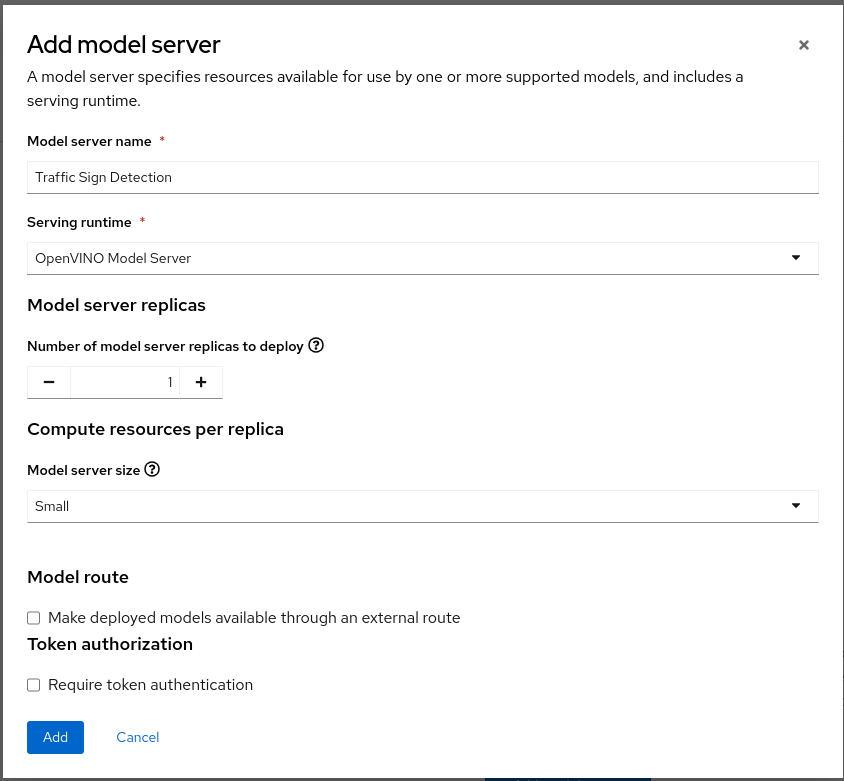

+++
title = "Model Serving"
draft= false
weight= 6
[[resources]]
  src = '**.png'
+++

At this point, you will deploy the model the just created into RHOAI model serving. If something went wrong with the model traning you can still do this section. Just follow the first "Fallback" section.

Once again, in the following objects that you will create, **please change "userX"** with your real user ID.

## Fallback - You can skip if you have a tranined model

* In your Data Science project, create a data connection that refers to the global model registry where we stored a pre tranined model. To do so, go to your data science project, scroll down and click "Data Connections" or click directly to the "Data Connections" tab on the top menu. Please refer to [this section](/ai/creating-project/#create-a-data-connection-for-the-pipeline-server) if you have difficulties to create a data connection.
* Here is the info you need to enter:
    - Name: ```Model Registry```
    - Access Key: ```userX``` - **Change with your USER ID**
    - Secret Key: ``````
    - Endpoint: ``````
    - Region: ```none```
    - Bucket: ``````

## Create a Model Server

In your project create a model server. You can click here to go to see all your deployed models:


* Click **Add model server**


* Here is the info you need to enter:

- Model server name: ``````
- Serving runtime: ```OpenVINO Model Server```
- Number of model server replicas to deploy: ```1```
- Model server size ``````
- Accelerator ```None```
- Model route ```unchecked```
- Token authorization ```unchecked```


* The result should look like:


* You can click on **Add** to create the model server.

## Deploy the Model

In your project, under **Models and model servers** select **Deploy model**.

* Click **Deploy model**


* Here is the information you will need to enter. **If are on the fallback track, please change the "Existing data connection - Name" with the name of the data connection you created (Model Registry)**:

    - Model name: ``````
    - Model server: ``````
    - Model server - Model framework: ```onnx-1```
    - Existing data connection - Name: `````` - **FOR FALLBACK track: use ```Model Registry```**
    - Existing data connection - Path: ``````

* The result should look like:


* Click on **Deploy**.
* If the model is successfully deployed you will see its status as green after few seconds.


We will now confirm that the model is indeed working by querying it!

## Querying the served Model

Once the model is served, we can use it as an endpoint that can be queried. We'll send a request to it, and get a result. This applies to anyone working within our cluster. This could either be colleagues, or applications.

* First, we need to get the URL of the model server.
* To do this, click on the **Internal Service** link under the **Inference endpoint** column.
* In the popup, you will see a few URLs for our model server.


* Note or copy the **RestUrl**, which should be something like `http://modelmesh-serving.{user}:8008`

We will now use this URL to query the model. Go back to the your running workbench i.e the jupyter notebooks environment.

- In your running workbench, navigate to the notebook `inference/inference.ipynb`.
- Execute the cells of the notebook, and ensure you understand what is happening.

The first section queries the base model that has been deployed globally for everyone. The second section takes your RestUrl endpoint and queries the model that you have tranined and deploy. You should see that with the base model, only the speed limit traffic signs are recognized. After your model re-training you now have a model that can better detect lego traffic signs. Congratulations!