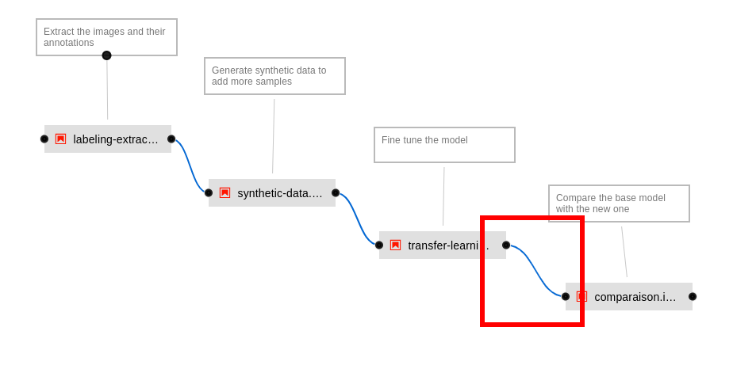
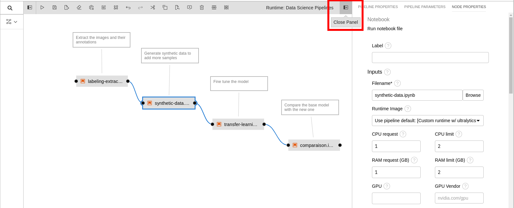
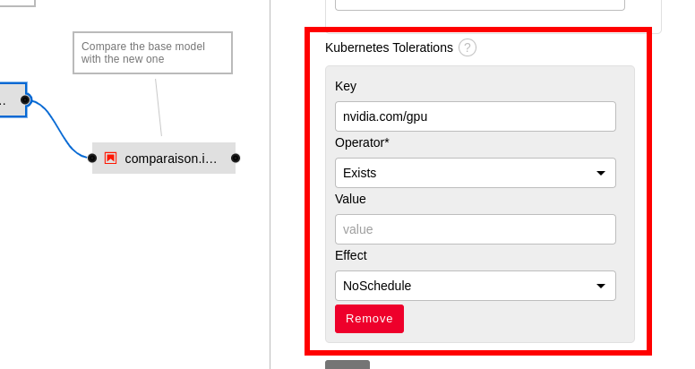
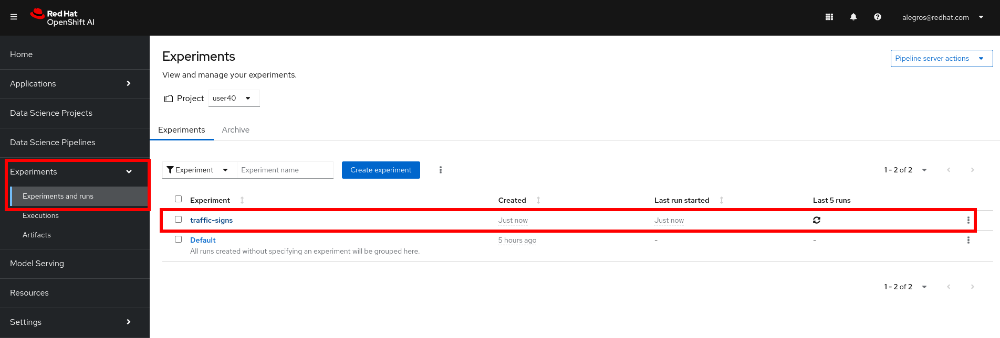
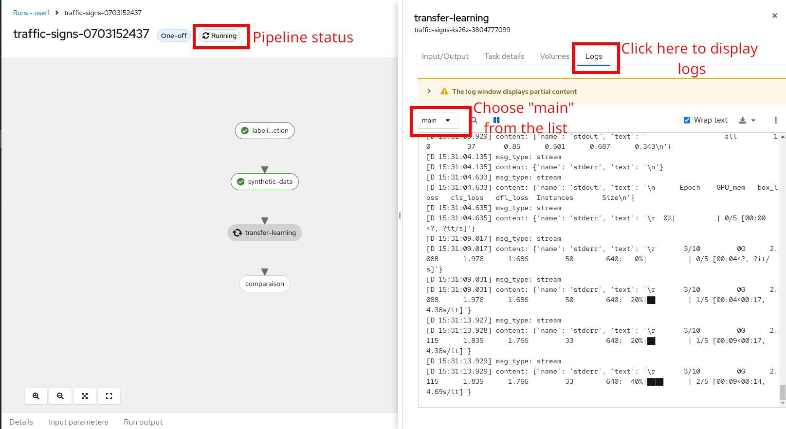
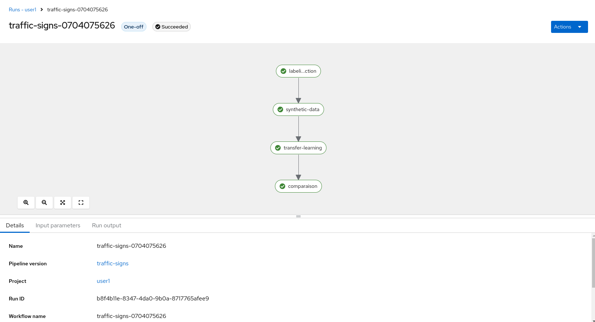
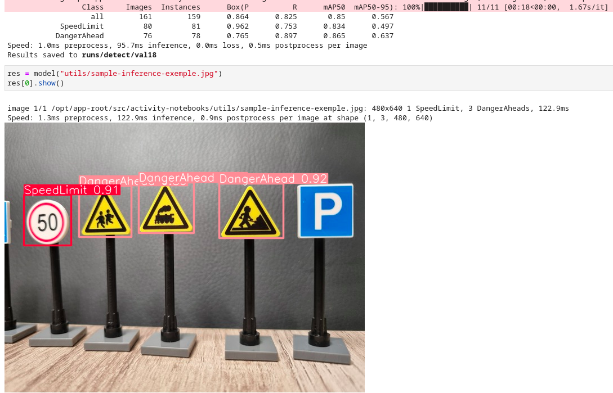

+++
title = "Retrain the model"
draft= false
weight= 4
[[resources]]
  src = '**.png'
+++

In this section you will navigate through the python code used to retrain the model. You will then adapt a data science pipeline and run it on Openshift. You will finally visualize your pipeline in Openshift AI dashboard and retreive its output in different formats.

**WARNING:** You will run only the first steps of the model training inside the Jupyter Notebooks. The full training will happen on Openshift side in order to limit the RAM needed for each participant. Running the model training (*transfer-learning.ipynb*) notebook will crash due to OOM Killed. Your pod on Openshift will be deleted and automatically recreated. Nothing really bad but your environement will be down for a minute.

## Navigate through the code

You previoulsy cloned a git repository. You should see on the file browser on the left hand side a folder that as the same name as the git projet: **. **Click** on it. From there you should see several objects:
  - The *utils/* folder contains helpers and dependencies for the model training such as python functions or mappers
  - The *inference/* folder contains material to query the models after you deployed them. We will use the content later on the lab.
  - The *traffic-signs.pipeline* is a data science pipeline generated with Elyra. Elyra provides a graphical user interface that enables you to drag and drop your notebooks or python scripts and bind them together to create steps. You can run this pipeline in Openshift from the GUI.
  - The *labeling-extraction.ipynb* notebook gets the images tagged with label studio. It downloads the images as well as their corresponding objects labeled with bounding boxes.
  - The *synthetic-data.ipynb* notebook generates random synthetic data. Those are artifically created data that will add more data to the model training.  
  - The *transfer-learning.ipynb* notebook is the model training itself.
  - The *comparison.ipynb* notebook will compare the base model (that does not recognize the lego traffic signs) with the one you will train (that hopefully does). We want to ensure no regression on the model retraining.


### Extract the images and their annotations

Click on *labeling-extraction.ipynb*. Run the whole notebook using the icon on the top and click on restart the kernel when asked to (see bellow):


You may have noticed that those scripts has created in your filesystem a *dataset* directory. This *dataset* directory contains a *labels* and a *images* sub-directory. It contains the extracted images and labels. Jump down on the same notebook on the section "Select a random image and display its boundind boxes". Re-run that cell. It chooses a random image from the *dataset/images* and displays in the notebook the corresponding bounding boxes saved under *dataset/labels*.

### Generate synthetic data

You can close the preivous notebook and open the *synthetic-data.ipynb* notebook. This notebook generates random synthetic data. Those are artifically created data that will add more data to the model training. Run the whole notebook as explained on previous section. Have a quick look at the code and see examples on the visualization sections. Re-run the visualizaton step to display more synthetic data examples.

### Review the model training step

Be careful not to run the following notebook. It will crash your environement as we limited the allowed consommable RAM per environement.  
Open *transfer-learning.ipynb* notebook and simply look at the code.

### Review the comparison step

Be careful not to run the following notebook. It will crash your environement as we limited the allowed consommable RAM per environement.  
Open *comparison.ipynb* notebook and simply look at the code.

## Adapt the data science pipeline

You will now adapt a data science pipeline to make your training be scheduled on a GPU. There are few small shared GPUs where the training will be executed. It should take around 8 minutes for the whole pipeline.

* **Open** the *traffic-signs.pipeline* data science pipeline.

Here you see a graphical interface where you can create and run your data science pipelines. The pipeline has been created by drag and dropping the steps in the UI.

### Fix the pipeline

You can notice that this pipeline has 4 nodes and 2 bindings. 1 binding is missing between the third (*transfer-learning*) and fourth step (*comparison*). Click on the black dot on the right hand side of the third step (*transfer-learning*).  Hold down the mouse key until you reached the black dot of the left hand side of the fourth step (*comparison*).

You should have a similar result at the end:


### Review the node properties

Right click on the second step of the pipeline (**synthetic-data**). This will open a menu. Click on "Open Properties". They appear on the right hand side. Scroll down and see some properties such as:
  - Runtime Image: Is the container image that will be used to run the python code extracted from your notebooks.
  - CPU request: Is the amount of CPU that should be available on the node for this particular step.
  - RAM limit: Is the maximum amount of RAM allowed for this particular step (container will be killed otherwise).
  - Pipeline Parameters: Make the globally declared pipeline parameters available for this particular step.
  - File Dependencies: Files that should be available on the container for the step execution. Here we need the whole *utils/* directory.
  - Output Files: Thoses files generated during execution will be available to subsequent pipeline steps.
  - Kubernetes Secret: Mount a secret inside inside the container. Here we make the object storage credentials available as environement variable during the execution.

You can notice on the top of the right hand side properties menu that 3 different panels are available (pipeline properties, pipeline parameters, node properties). Feel free to navigate to the other panels.

### Request a GPU for the "transfer-learning" step

**Close the panel properties** opened on the previous step.

You will now **work on the third step**.
Right click on the third step of the pipeline (**transfer-learning**). This will open a menu. Click on "Open Properties". They appear on the right hand side. Look for the **GPU** property and select **1**. This will request 1 GPU for your model training. 

Scroll down to bottom.  
The nodes containing GPUs has "Taints". It means that by default no workload can be scheduled on nodes with taints. We need to add a toleration to allow the training step to use a GPU. Taints and tolerations work together to ensure that pods are not scheduled onto inappropriate nodes.  
**Click Add under Kubernetes Tolerations** (at the bottom of the node properties panel). Fill up as follow:
- Key: type **```nvidia.com/gpu```**
- Operator: select **Exists**
- Effect: select **NoSchedule**

You should have at the end:


## Run the pipeline

It's now time to run the pipeline on Openshift. Click on the "Run Pipeline" button on the top of Elyra GUI. See bellow:

**If** you have a popup warning you that the pipeline is **not saved**, click on the "**Save and Submit**" button.  
Fill up the configurations. **Choose 10 epochs** as a pipeline parameter. It corresponds to the total number of iterations of all the training data in one cycle for training the machine learning model. Not enough epochs will cause your model to be inefficient. Too much epochs will cause your model to overfit (and thus being inefficient on predicting new data):

After a few moments, you will see a successful popup displayed. From this popup, you can click on "Run Details" to skip some instructions of the next session.


## Visualizing your pipelines

### Retreive the pipeline runs

**If you missed the shortcut from elyra popup**, follow thoses steps to retreive your pipeline run. Otherwise pass to the next paragraph.
You can now go back to Openshift AI dashboard: [https://rhods-dashboard-redhat-ods-applications.apps.](https://rhods-dashboard-redhat-ods-applications.apps.)
On the left hand side **click on "Experiments", then on "Experiments and runs"**. Choose the expriment associated with your pipeline name. 

**Click on the run**. Here can see the pipeline execution. One run should be visible as you created one during the previous section. Click on it.

You can see the status of your pipeline run. If you click on a node it displays some information such as the "Logs" panel. If you select the "Main" container from that panel, you will see the logs associated to the notebooks execution:


Wait for the pipeline to complete. You should have something like that:


## Retreiving pipelines output

All the pipeline outputs are stored into the object storage. Connect to the S3 console using this link: [](). **Connect with the same username** we gave you at the begining of the lab. **The password is ``````**. You should see few buckets. Click on the one corresponding to your username. There you have an "results.csv" file corresponding to your model performance. Download it if you wish.There should be one directory in the bucket that coresponds to your pipeline run. It starts with "traffic-sign". Open it. Here you can see html, ipynb files and archives. Click on the *comparison.html* file. A menu pops up on the right hand side. Click download and open this file locally on your browser. Note the difference in the scores of the base and new model. In this example we lost precision on the original dataset. But we can now detect "lego" traffic signs with the new model.

