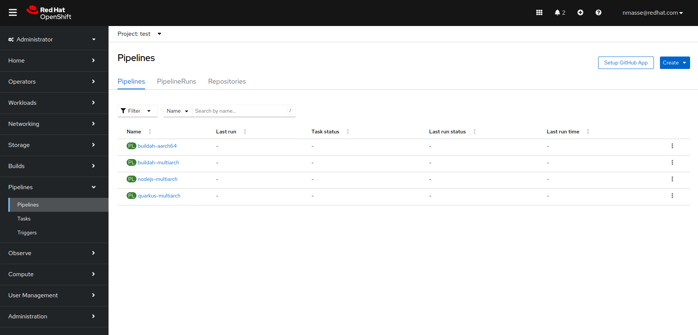
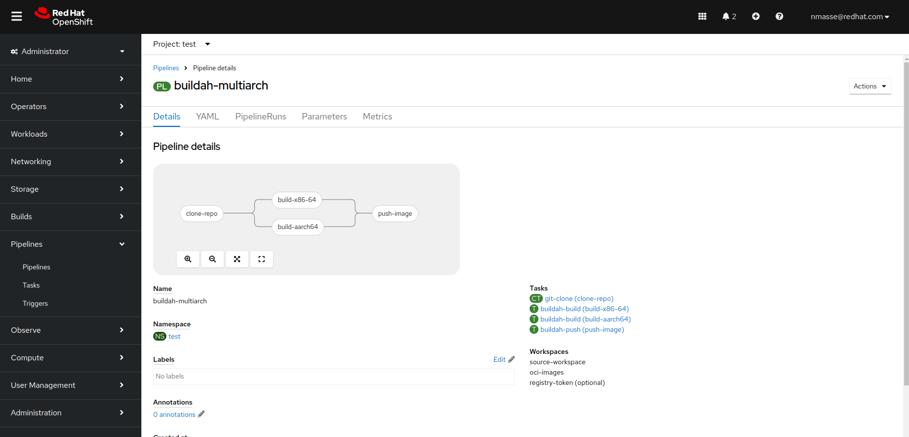
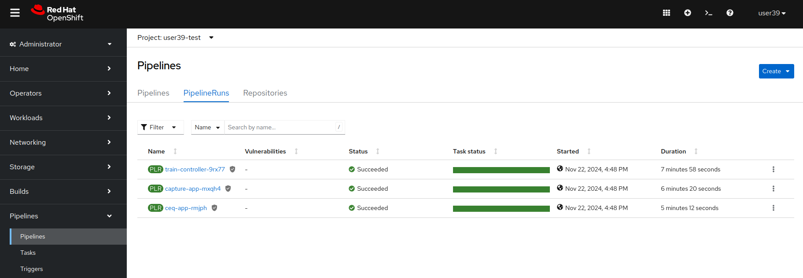
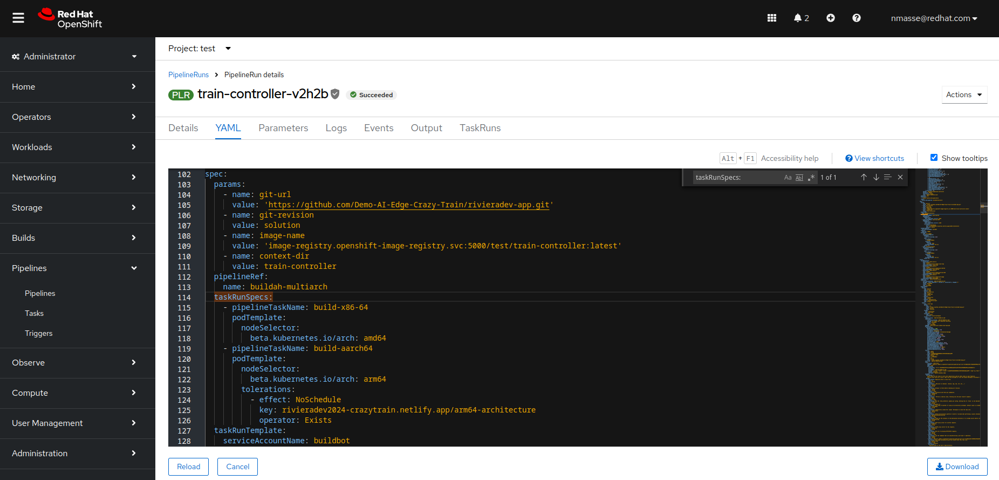

+++
title = "CI/CD Pipelines"
draft = false
weight = 1
[[resources]]
  src = '**.png'
[[resources]]
  src = '**.svg'
+++

In this step, you will deploy the CI/CD pipelines that will build the container images of the five main components of the train:

- **capture-app**
- **intelligent-train**
- **monitoring-app**
- **train-ceq-app**
- **train-controller**

To help you, a Helm chart is available in the application's mono repo (folder `tekton-pipelines`).
This Helm chart contains multi-architecture Tekton pipelines.
Indeed, the Nvidia Jetson Orin card in the train is an arm64 architecture.
Your laptop is probably an x86_64 architecture.

To build these multi-architecture container images, we need :

- An OpenShift cluster composed of x86_64 and arm64 Compute nodes.
- A Tekton pipeline orchestrating image constuctions on these two nodes and combining the resulting images into a manifest which is then deposited on the quay.io registry.
- AWS EFS persistent storage to store source code, artifacts and container images before sending them to the quay.io registry.

[](https://www.itix.fr/blog/build-multi-architecture-container-images-with-kubernetes-buildah-tekton-aws/)

You'll deploy the tekton pipelines from your OpenShift DevSpaces environment (it'll be easier).

## Fetch the last version from Git

We just fixed the code of the Tekton pipelines.
Please fetch the last version.

```sh
cd /projects/volcamp2025-app
git pull
```

## Deploying Tekton pipelines

To do this, open a terminal in VScode.

- Open the hamburger menu (three horizontal lines at top left) from your DevSpaces workspace.
- Click on **Terminal** > **New Terminal**.

From the terminal, discover the projects to which you have access.

```sh
oc get projects
```

You should see three OpenShift projects:

- Your DevSpaces workspace (`$USERID-devspaces`)
- The test project (`$USERID-test`)
- The OpenShift AI project (`$USERID`)

Get the name of the test project from an environment variable.

```sh
TEST_NS=$(oc get projects -o name -l env=test | cut -d / -f 2 | head -n 1)
echo "Using namespace $TEST_NS"
```

Create the objects in your OpenShift test project.

```sh
helm template pipelines /projects/volcamp2025-app/tekton-pipelines --set namespace="$TEST_NS" | oc apply -f -
```

{}
The warning message *"WARNING: Kubernetes configuration file is group-readable. This is insecure. "* can be ignored.
{}

Open the [OpenShift console]() and navigate to **Administrator** > **Pipelines** > **Pipelines** > **Pipelines**.



Open the four pipelines, one by one, and observe their differences.
How are build tasks executed on arm64 and x86_64 architectures?
Parallel or serial?



## Launching Tekton pipelines

Create the objects in your OpenShift test project.

```sh
helm template pipelines /projects/volcamp2025-app/tekton-pipelines --set namespace="$TEST_NS" --set runPipelines=true | oc create -f -
```

{}
The warning message *"WARNING: Kubernetes configuration file is group-readable. This is insecure. "* can be ignored.
{}

Typically, pipelines will start immediately.

Open the [OpenShift console]() and navigate to **Administrator** > **Pipelines** > **Pipelines** > **PipelineRuns**.



Click on the PipelineRun of the **train-controller** component.
Open the YAML tab, press **Ctrl** + **F** and enter `taskRunSpecs:`.

Which Kubernetes functions did we use to place the Tekton ARM64 tasks on the corresponding nodes?



## Next step

The pipelines take about 20 minutes for the slowest to finish.
While it's compiling, it's time to move on to the next step!
